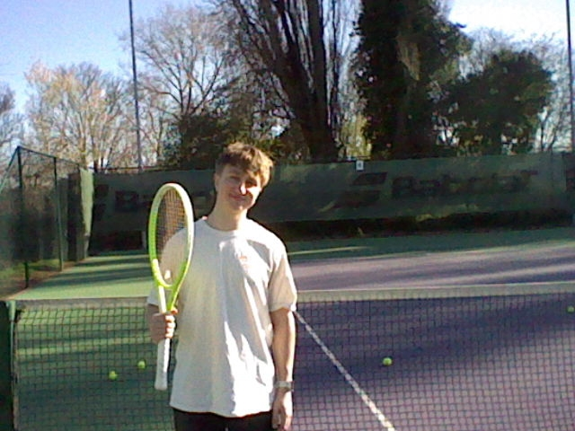
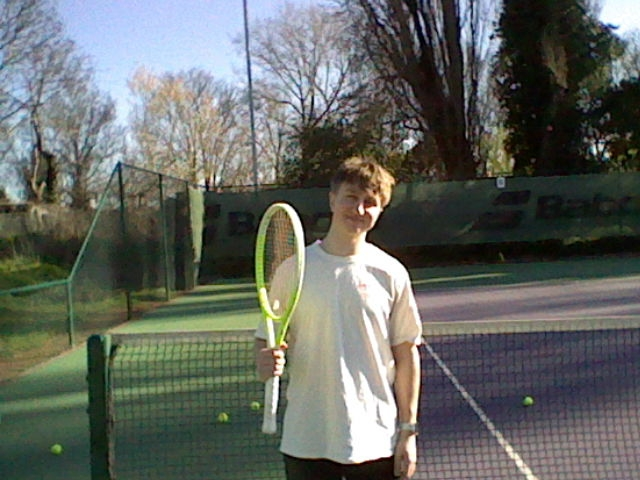
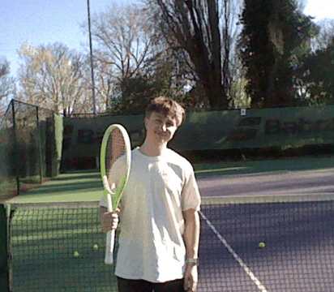

# 🎮 3DS MPO Wobble Tool

> *Bringing Nintendo 3DS stereo photographs back to life — as animated GIFs anyone can share.*

---

<!-- HERO IMAGE -->
<!-- 💡 Add a banner image or screenshot of the app here -->
<!-- Recommended: a wide screenshot of the app UI, or a side-by-side of an MPO pair and its resulting wobble GIF -->
<!--  -->

---

## What is this?

The Nintendo 3DS was one of the few consumer cameras to ever shoot **true stereoscopic photographs** — two slightly offset images captured simultaneously and stored together in a single `.mpo` file. On the 3DS screen, the parallax between the two lenses created a genuine glasses-free 3D effect.

The problem? Once those photos leave the 3DS, they're essentially trapped. The `.mpo` format is poorly supported, the 3D effect dies outside of the original hardware, and most people have hundreds of these images sitting on old SD cards going nowhere.

This tool fixes that.

---

## Why I built this

<!-- 💬 This is your space — fill in your personal story here -->
<!-- Some prompts to get you started: -->
<!-- - When did you get your 3DS? What did you photograph with it? -->
<!-- - When did you rediscover your old MPO files? -->
<!-- - What frustrated you about existing solutions? -->
<!-- - Why did the wobble GIF format appeal to you specifically? -->

> *[Add your personal motivation here — why this mattered to you, what memories or photos prompted it, and what you wanted to preserve.]*

---

## How it works

The classic technique for conveying depth from a stereo pair is the **wobble GIF** — rapidly alternating between the left and right frames creates an illusion of parallax motion that your brain reads as three-dimensional structure. It's an old trick from the stereoscopy community, and it works beautifully.

### The pipeline

```
.mpo file  →  extract frames  →  align & crop  →  crossfade  →  animated GIF
```

**1. Extraction**
An `.mpo` file is technically a multi-image JPEG — two full JPEG frames concatenated together with some metadata. Python's Pillow library can seek through frames, so extracting the left and right images is straightforward.

**2. Alignment**
The two 3DS lenses are physically offset, which means the stereo pair has a horizontal disparity. If left uncorrected, the wobble effect looks chaotic rather than three-dimensional. The tool lets you dial in a **symmetric crop** — trimming the right edge of the left image and the left edge of the right image by the same number of pixels — to bring the two frames into alignment.

**3. Diff scoring**
To take the guesswork out of alignment, the tool computes a **mean absolute pixel difference** across all RGB channels between the two cropped frames. A lower score means the images are more similar — which generally means better aligned. There's also an auto-optimise button that brute-forces every possible crop value and picks the one with the lowest diff score.

**4. Crossfade & export**
Rather than a hard cut between frames, the tool generates smooth **crossfade transitions** between left and right views. The number of transition steps, hold duration, and total cycles are all configurable. The result is saved as an optimised, looping GIF.

---

## Example output

<!-- 🎞️ Add your example wobble GIFs here — this is the most compelling part of the README -->
<!-- Show a before (the raw left/right pair) and after (the wobble GIF) -->

**Left frame / Right frame:**

<!--   -->
> *[Add a side-by-side of your left and right frames here]*

**Resulting wobble GIF:**

<!--  -->
> *[Add your wobble GIF here — this is the money shot]*

---

## Features

| Feature | Description |
|---|---|
| 📂 **MPO extraction** | Pulls both stereo frames directly from a `.mpo` file |
| ✂️ **Crop alignment** | Symmetric crop slider to manually align the stereo pair |
| 📊 **Diff scoring** | Mean absolute pixel difference to quantify alignment quality |
| 🎯 **Auto-optimise** | Brute-force search across all crop values to find the best alignment |
| 🔀 **Crossfade** | Smooth interpolated transitions between frames |
| ⚙️ **Full GIF control** | Configure cycles, frame hold duration, crossfade steps, and output scale |
| 📥 **One-click download** | Export your wobble GIF directly from the browser |

---

## Running locally

**Requirements:** Python 3.9+

```bash
git clone https://github.com/YOUR_USERNAME/YOUR_REPO_NAME.git
cd YOUR_REPO_NAME
pip install -r requirements.txt
streamlit run app.py
```

The app will open at `http://localhost:8501`.

---

## Using the app

1. **Upload** your `.mpo` file using the file picker
2. **Check the stereo pair** — you should see two slightly offset versions of the same scene
3. **Adjust the crop** — drag the slider until the diff score is low, or hit **Minimise Diff Value** to auto-optimise
4. **Review the overlay and diff image** — the overlay should look sharp, not doubled; the diff image should be mostly dark
5. **Configure your GIF** — tune the wobble cycles, frame duration, and crossfade steps to taste
6. **Generate and download** — hit Generate GIF, wait for encoding, then download

---

## Built with

- [Streamlit](https://streamlit.io) — app framework
- [Pillow](https://python-pillow.org) — image processing and GIF encoding
- [NumPy](https://numpy.org) — diff score calculation
- Hosted on [Streamlit Community Cloud](https://share.streamlit.io) — free tier

---

## Limitations & known issues

- The auto-optimise crop search works well for scenes with even lighting and clear depth cues, but can produce unexpected results on very uniform or bright-sky shots where pixel similarity doesn't correlate cleanly with alignment
- GIF colour depth is limited to 256 colours per frame — fine for most 3DS photos but noticeable on images with complex gradients
- Very long GIFs (high cycle count + many crossfade steps) can take 10–20 seconds to encode

---

## Licence

MIT — do whatever you like with it.

---

*Made with nostalgia and mild frustration at the `.mpo` format.*
