# 3DS Wobble GIF Generator

> Bring Nintendo 3DS stereoscopic photos back to life as animated wobble GIFs, entirely in your browser.

<br>

<!-- HERO IMAGE -->

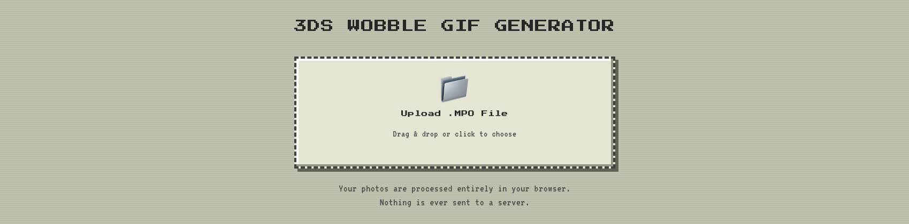

## Try it

**No installation required** - the app runs entirely in your browser and is free to use:

🔗 **[3ds-wobble-gif.vercel.app](https://3ds-wobble-gif.vercel.app/)**

Your photos are processed locally. Nothing is uploaded to a server.

---

## What is this?

The Nintendo 3DS was one of the few consumer cameras to shoot **true stereoscopic photographs**: two slightly offset images captured at the same moment and stored together in a single `.mpo` file. On the 3DS screen, the parallax between the two lenses created a genuine glasses-free 3D effect.

Outside the 3DS, the `.mpo` format is almost unusable. The 3D effect is lost and the photos sit forgotten on old SD cards.

This tool fixes that by turning any `.mpo` file into a **wobble GIF**: an animated loop that rapidly alternates between the left and right frames. Your brain reads the parallax motion as depth, so the original 3D feel comes through on any device with no special hardware needed.

---

## How it works

```
.mpo file  →  extract frames  →  align  →  customise  →  animated GIF
```

**1. Extraction**
An `.mpo` file is a multi-image JPEG: two full JPEG frames concatenated together with metadata. The parser splits them into separate left and right images.

**2. Alignment**
The two 3DS lenses are physically offset, so the stereo pair has horizontal and vertical disparity. Uncorrected, the wobble looks chaotic. The app lets you nudge the frames into alignment manually, or use one of the auto-align methods to find the best shift.

**3. Diff scoring**
To remove the guesswork, the app computes a **mean absolute pixel difference** between the two aligned frames. A lower score means the images are more similar, which usually means better alignment. The diff view and diff graphs make this visible.

**4. Customise and export**
Choose your frame hold time, crossfade smoothness, output scale, and looping behaviour, then generate an optimised looping GIF. You can also download an anaglyph (red/cyan) version of the aligned pair.

---

## Example output

<!-- **Left frame** -->

<!-- 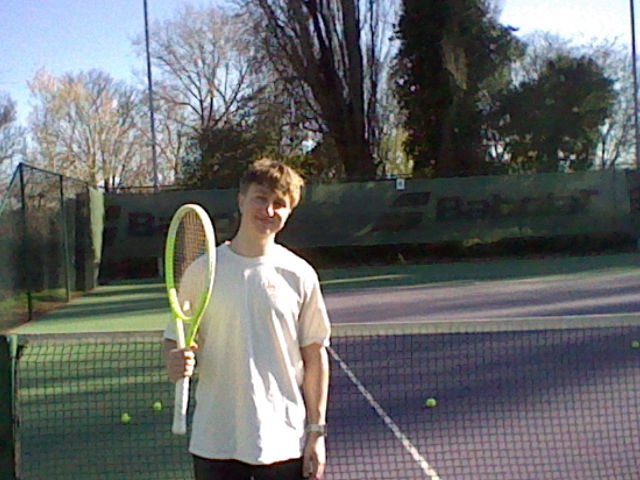 -->

<!-- **Right frame:** -->

<!-- 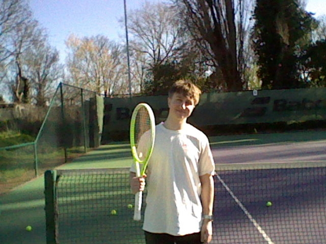 -->

<!-- **Resulting wobble GIF:** -->

<!-- 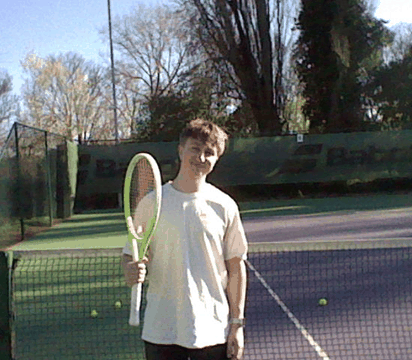 -->

<table>
  <tr>
    <td></td>
    <td></td>
  </tr>
  <tr>
    <td align="center">Left frame</td>
    <td align="center">Right frame</td>
  </tr>
  <tr>
    <td colspan="2" align="center"></td>
  </tr>
  <tr>
    <td colspan="2" align="center">Resulting wobble GIF</td>
  </tr>
</table>

---

## Features

| Feature                       | Description                                                                  |
| ----------------------------- | ---------------------------------------------------------------------------- |
| **MPO extraction**            | Splits a Nintendo 3DS `.mpo` file into left and right frames                 |
| **Simple and Advanced modes** | A quick path for fast results, or full control over every setting            |
| **Manual alignment**          | Horizontal and vertical shift sliders with live overlay and diff views       |
| **Diff Search: Ternary**      | Fast pixel-difference search that finds the best alignment automatically     |
| **ML: Subject Detection**     | Uses a lightweight ONNX model to detect the main subject and align around it |
| **Diff visualisation**        | See the search steps and diff graphs to understand how alignment was found   |
| **GIF settings**              | Control hold delay, transition delay, crossfade frames, scale, and looping   |
| **Anaglyph export**           | Download a red/cyan anaglyph of the aligned stereo pair                      |
| **Client-side only**          | Your images never leave your browser                                         |

---

## Using the app

1. **Upload** your `.mpo` file on the start screen.
2. **Adjust** the alignment using the sliders, or click one of the auto-align buttons.
3. **Tune the GIF settings** to control speed, smoothness, size, and looping.
4. **Generate and download** your wobble GIF, or grab the anaglyph version.

---

## Running locally

**Requirements:** Node.js 18+

```bash
git clone https://github.com/chriskersov/3DS-wobble-gif.git
cd 3DS-wobble-gif/client
npm install
npm run dev
```

The app will open at `http://localhost:5173`.

To create a production build:

```bash
npm run build
```

---

## Built with

- [React](https://react.dev) - UI library
- [Vite](https://vitejs.dev) - build tool and dev server
- [gifenc](https://github.com/mattdesl/gifenc) - GIF encoding in the browser
- [ONNX Runtime Web](https://onnxruntime.ai/docs/get-started/with-javascript/web.html) - running the subject segmentation model locally
- [mpo-parser](packages/mpo-parser) - local package for parsing `.mpo` files
- Hosted on [Vercel](https://vercel.com)

---

## Screenshots

### Upload Screen

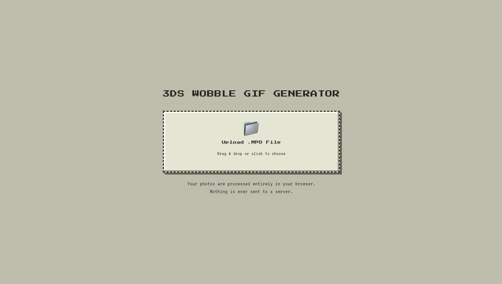

### Simple Page

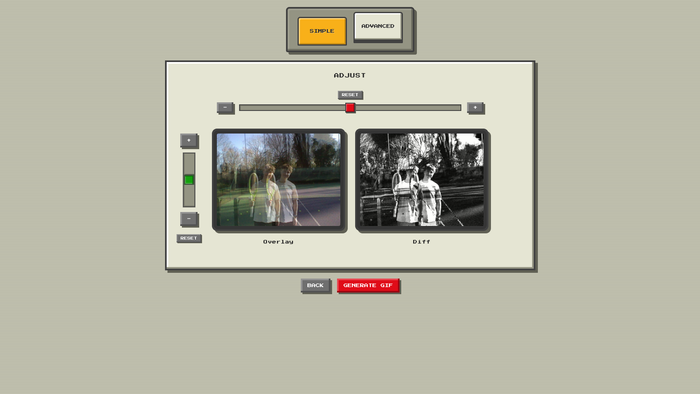

### Advanced Page - Adjust

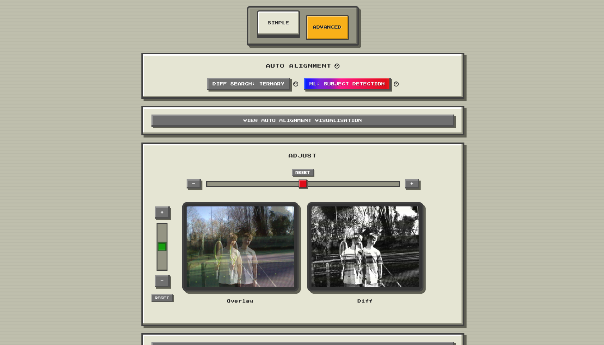

### Advanced Page - Auto Alignment

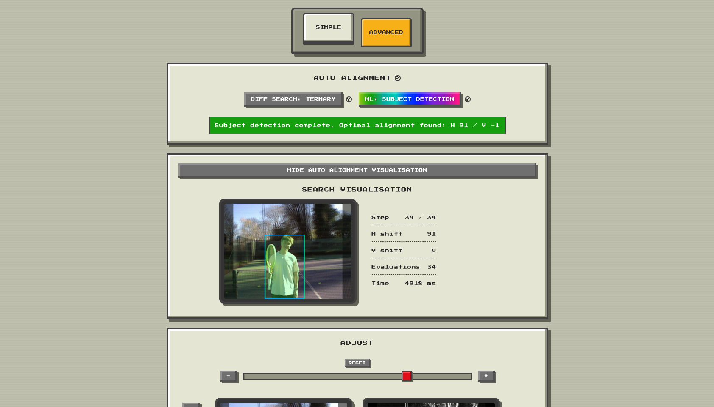

### Advanced Page - Diff Graphs

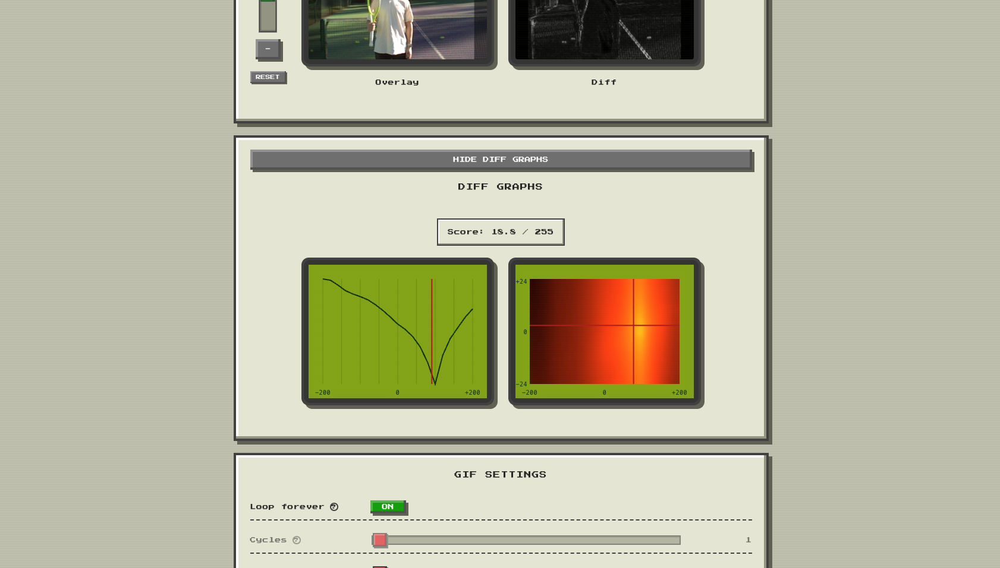

### Advanced Page - GIF Settings

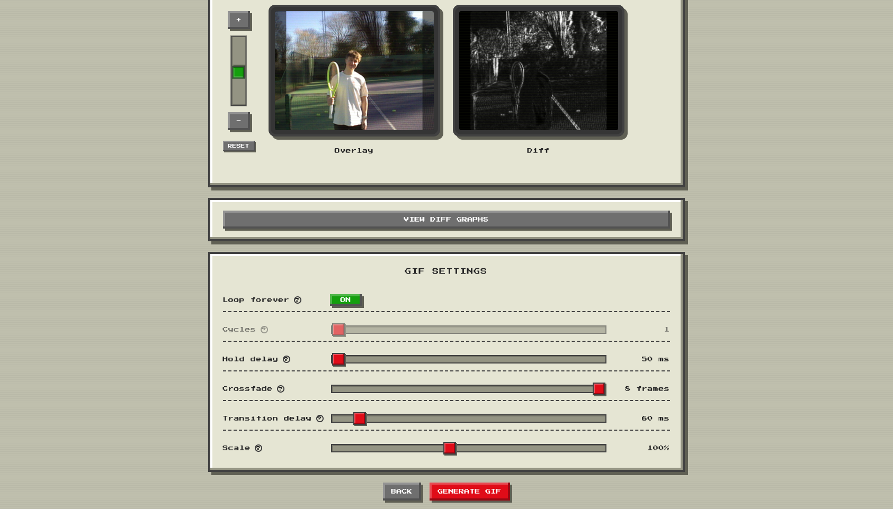

### Output

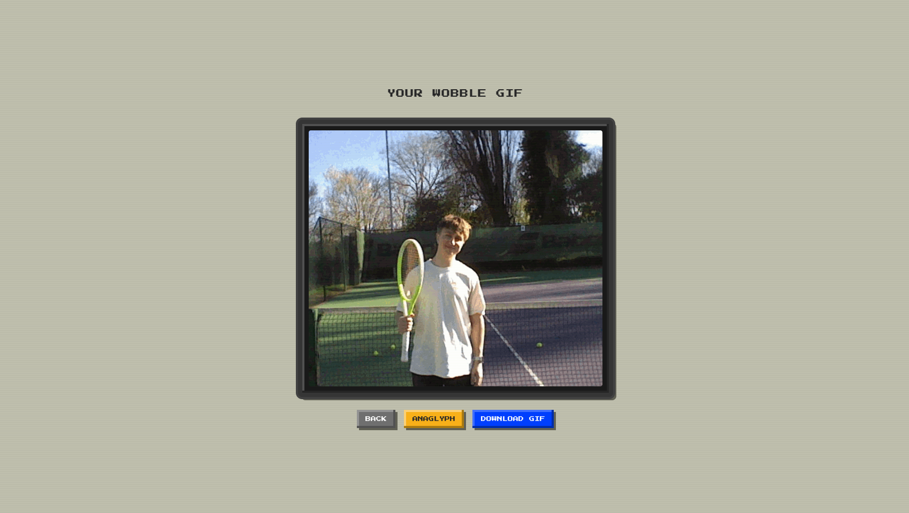

---
